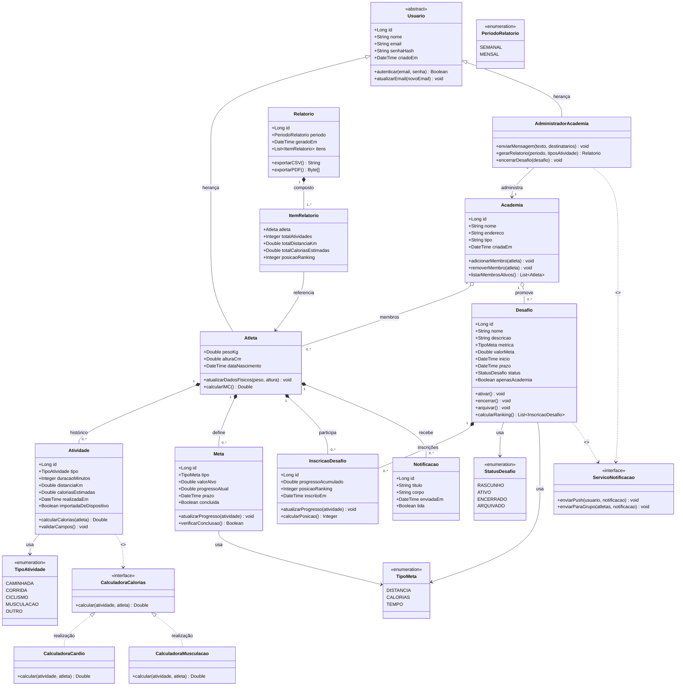

# Seção 1 — Diagrama de Classes

O diagrama abaixo modela as classes envolvidas nas três fatias selecionadas. Classes que aparecem em mais de uma fatia são representadas uma única vez.

---

## 1 Diagrama

---

## 1 Conceitos de UML

Hierarquia de `Usuario`: optou-se por uma classe abstrata `Usuario` com subclasses `Atleta` e `AdministradorAcademia`. A alternativa de uma única classe com atributo `perfil` (enum) foi descartada porque os dois perfis possuem atributos exclusivos (`pesoKg`, `alturaCm` para o atleta; vínculo com `Academia` para o administrador) e comportamentos claramente distintos, herança é mais expressiva neste caso.

Interface `CalculadoraCalorias`: a fórmula de cálculo varia por tipo de atividade (cardio usa duração × MET × peso, musculação usa uma estimativa diferente). Modelar com uma interface e implementações concretas por categoria permite extensão sem modificar a classe `Atividade`. Esta é uma aplicação do padrão Strategy.

`InscricaoDesafio` como classe associativa: o relacionamento entre `Atleta` e `Desafio` é muitos-para-muitos e carrega estado próprio (`progressoAcumulado`, `posicaoRanking`, `inscritoEm`). Uma tabela associativa simples não bastaria, a classe associativa é a representação correta.

`Relatorio` e `ItemRelatorio`: o relatório é um artefato gerado sob demanda (não é dado primário), mas pode ser persistido como cache para exportação. `ItemRelatorio` é uma composição, não existe sem o `Relatorio` que o originou.

`ServicoNotificacao` como interface: o serviço de envio de notificações é uma integração externa (push, e-mail). Modelar como interface permite que a implementação concreta seja trocada sem afetar o domínio, e explicita a dependência externa sem hard-codar detalhes de infraestrutura no diagrama de classes.

---

## 1.2 Classes por fatia

| Fatia | Classes envolvidas |
|---|---|
| Fatia 1 — Registro com calorias | `Atleta`, `Atividade`, `TipoAtividade`, `CalculadoraCalorias`, `CalculadoraCardio`, `CalculadoraMusculacao` |
| Fatia 2 — Ciclo de vida do desafio | `Atleta`, `AdministradorAcademia`, `Academia`, `Desafio`, `InscricaoDesafio`, `StatusDesafio`, `ServicoNotificacao` |
| Fatia 3 — Relatório do administrador | `AdministradorAcademia`, `Academia`, `Atleta`, `Atividade`, `Relatorio`, `ItemRelatorio`, `ServicoNotificacao` |