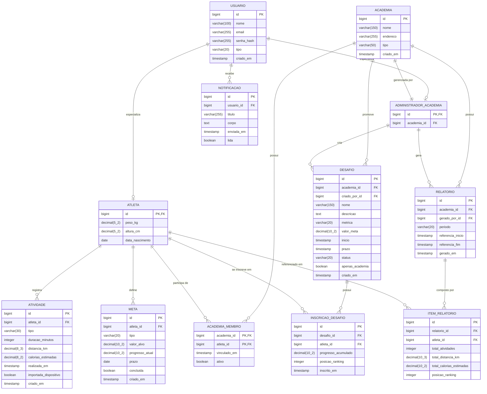

# Seção 2 — Modelo Entidade-Relacionamento (MER)

## 2. Diagrama

---

## 2.1 O que precisa ser modelado

### USUARIO
Entidade-raiz de todos os usuários do sistema. O campo `tipo` funciona como discriminador para a estratégia de herança adotada.

### ATLETA
Extensão de `USUARIO` com dados físicos específicos do perfil. `id` é ao mesmo tempo chave primária e chave estrangeira para `USUARIO`.

### ADMINISTRADOR_ACADEMIA
Extensão de `USUARIO`. A chave `academia_id` formaliza o vínculo 1:1 entre o administrador e sua academia.

### ACADEMIA
Representa uma academia ou grupo esportivo cadastrado na plataforma. Um único administrador é responsável por ela.

### ACADEMIA_MEMBRO
Tabela associativa que resolve o relacionamento N:N entre `ACADEMIA` e `ATLETA`. O campo `ativo` permite desativar o vínculo sem remover o histórico do atleta (conforme US-SUB1-003).

### ATIVIDADE
Cada linha representa um treino registrado por um atleta. `calorias_estimadas` é armazenado (não apenas calculado em tempo real) para preservar o histórico mesmo que os dados físicos do atleta sejam atualizados posteriormente.

### META
Metas pessoais do atleta. `progresso_atual` é mantido por atualização incremental a cada nova atividade relevante.

### DESAFIO
Desafio criado pela academia (ou por um atleta no caso de desafio pessoal — `academia_id` nullable). `status` persiste o estado do ciclo de vida modelado na Fatia 2.

### INSCRICAO_DESAFIO
Tabela associativa N:N entre `DESAFIO` e `ATLETA`, com estado próprio. `posicao_ranking` é atualizado periodicamente ou após cada nova atividade contabilizada.

### RELATORIO
Registro dos relatórios gerados pelo administrador. Permite que o administrador acesse relatórios anteriores sem necessidade de recalcular.

### ITEM_RELATORIO
Cada linha representa o resumo de um atleta dentro de um relatório. Os totais são calculados no momento da geração e armazenados (cache calculado).

### NOTIFICACAO
Notificações enviadas a usuários, tanto para atletas (lembretes, alertas de desafio) quanto para o administrador (confirmações de envio).

---

## 2.2 Conceitos Importantes

| Relacionamento | Cardinalidade |
|---|---|
| USUARIO → ATLETA | 0..1 : 1 (um usuário pode ser ou não atleta) |
| USUARIO → ADMINISTRADOR_ACADEMIA | 0..1 : 1 |
| ACADEMIA → ADMINISTRADOR_ACADEMIA | 1 : 1 |
| ACADEMIA → ACADEMIA_MEMBRO → ATLETA | N:N (via tabela associativa) |
| ATLETA → ATIVIDADE | 1:N |
| ATLETA → META | 1:N |
| ACADEMIA → DESAFIO | 1:N |
| DESAFIO → INSCRICAO_DESAFIO → ATLETA | N:N |
| RELATORIO → ITEM_RELATORIO | 1:N |
| USUARIO → NOTIFICACAO | 1:N |

---

## 2.3 Coerência com o diagrama de classes

Estratégia de herança: no diagrama de classes, `Usuario` é classe abstrata com subclasses `Atleta` e `AdministradorAcademia`. No MER, foi adotada a estratégia tabela por subclasse (table per subclass): uma tabela `USUARIO` com os atributos comuns, e tabelas `ATLETA` e `ADMINISTRADOR_ACADEMIA` com os atributos específicos, ligadas por chave estrangeira no `id`. A alternativa de tabela única com discriminador (single table inheritance) foi descartada porque os atributos específicos de cada subclasse são muitos e nullable nas linhas do outro tipo introduziria ruído desnecessário no banco.

`caloriasEstimadas` como atributo persistido: no diagrama de classes, `calcularCalorias()` é um método, sugerindo que o valor poderia ser derivado. No MER, optou-se por persistir `calorias_estimadas` na tabela `ATIVIDADE` porque: (a) os dados físicos do atleta podem mudar; (b) o histórico deve refletir o cálculo do momento do registro, não um recalculo posterior; (c) evita re-processamento a cada leitura do histórico.

`ItemRelatorio` como tabela persistida: no diagrama de classes, `Relatorio` poderia ser um objeto transiente (gerado sob demanda). No MER, optou-se por persistir tanto `RELATORIO` quanto `ITEM_RELATORIO` para: (a) permitir exportação posterior sem re-processamento; (b) preservar o snapshot do momento da geração, mesmo que novas atividades sejam registradas depois.

`ServicoNotificacao` ausente no MER: é uma interface de integração externa (push notification), não uma entidade com estado persistido no banco do sistema. A tabela `NOTIFICACAO` persiste o registro do que foi enviado (log), mas a lógica de envio é responsabilidade do serviço externo.
