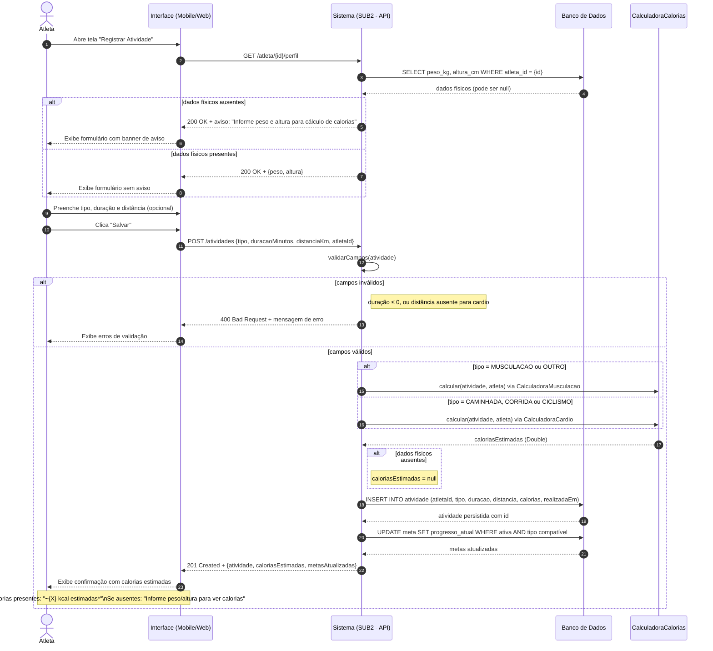

# Seção 3 — Modelagem Comportamental: Fatia 1

## Fatia 1 — Atleta registra atividade física com cálculo de calorias

**Opção A — Diagrama de Sequência**

Justificativa: A Fatia 1 envolve coordenação entre múltiplos componentes numa sequência temporal bem definida — Atleta (ator externo), Interface (frontend), Sistema de Registro (backend/SUB2) e Calculadora de Calorias (componente interno com regra de negócio). O diagrama de sequência é o mais adequado porque: (a) há mensagens síncronas com retorno entre camadas distintas; (b) a lógica condicional (`alt`) é necessária para modelar os caminhos de erro (dados físicos ausentes, campos inválidos por tipo de atividade) e o cálculo alternativo por categoria; (c) o tempo de execução é linear e curto, sem ciclo de vida duradouro que justificasse um diagrama de estados.

---

## Diagrama de Sequência

---

## Notas sobre o diagrama

Fragmento `alt` — dados físicos ausentes: o sistema consulta os dados físicos antes de exibir o formulário para personalizar a experiência. Se ausentes, exibe aviso sem bloquear o registro — o atleta pode registrar atividades sem informar peso e altura, mas não terá o cálculo de calorias.

Fragmento `alt` — validação: a validação acontece no backend após o POST. Campos obrigatórios variam por tipo: distância é obrigatória para cardio (caminhada, corrida, ciclismo) e opcional para musculação.

Fragmento `alt` — seleção da calculadora: implementação do padrão Strategy modelado no diagrama de classes. A API seleciona a implementação correta de `CalculadoraCalorias` com base no tipo de atividade.

Atualização de metas: ao persistir a atividade, o sistema verifica se há metas ativas compatíveis com o tipo e a métrica da atividade registrada e atualiza o progresso. Isso é um efeito colateral do registro, não uma ação separada do atleta.

Nota de estimativa: a interface deve deixar explícito que o valor exibido é uma estimativa (`*`), conforme critério de aceitação da US-SUB2-002 e RF05 do documento de visão.
