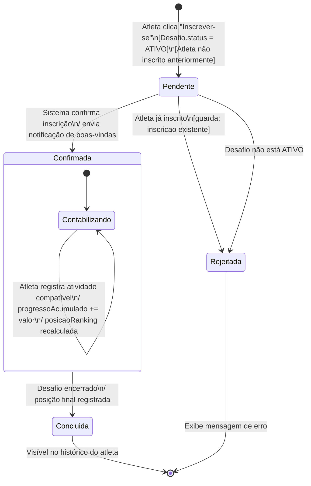

# Seção 3 — Modelagem Comportamental: Fatia 2

## Fatia 2 — Ciclo de vida de um desafio: da criação à conclusão

**Opção B — Diagrama de Estados**

Justificativa: A Fatia 2 gira em torno de uma entidade — o Desafio — com ciclo de vida bem definido: criado, ativado, em andamento, encerrado e arquivado. Cada transição é disparada por um evento, pode ter uma guarda (condição) e produz ações automáticas (notificações, bloqueio de contabilização). O diagrama de estados é o mais adequado porque: (a) o Desafio tem estados claramente identificáveis com semântica distinta; (b) as transições têm regras explícitas (ex.: não é possível se inscrever em desafio ENCERRADO); (c) há eventos de timeout (prazo expirado) e eventos explícitos (administrador encerra antecipadamente). Um diagrama de sequência capturaria um fluxo único, mas não evidenciaria a riqueza das transições e guardas do ciclo de vida.

Além do ciclo de vida do Desafio, é apresentado o ciclo de vida da Inscrição do Atleta — entidade separada com estados próprios.

---

## Diagrama de Estados — Desafio

```mermaid
stateDiagram-v2
    [*] --> Rascunho : Admin cria desafio

    Rascunho --> Ativo : Admin publica\n[dados válidos preenchidos]
    Rascunho --> [*] : Admin descarta

    state Ativo {
        [*] --> AguardandoInscricoes
        AguardandoInscricoes --> EmAndamento : Data de início atingida
        EmAndamento --> EmAndamento : Atleta registra atividade\n/ atualiza progressoAcumulado\n/ recalcula ranking
    }

    Ativo --> Encerrado : Prazo expirado\n[status = ATIVO]\n/ notificar participantes com ranking final
    Ativo --> Encerrado : Admin encerra antecipadamente\n/ notificar participantes com ranking final

    Encerrado --> Arquivado : Admin arquiva\n[após 30 dias ou ação manual]

    Encerrado --> [*] : (estado terminal de negócio;\ndesafio visível no histórico)
    Arquivado --> [*] : (somente consulta)

    note right of Ativo
        Inscrições permitidas apenas neste estado.
        Nenhuma atividade contabilizada após transição
        para Encerrado.
    end note
```

---

## Diagrama de Estados — Inscrição do Atleta no Desafio

---

## Transições e regras de negócio modeladas

| Evento | Estado origem | Estado destino | Guarda | Ação automática |
|---|---|---|---|---|
| Admin publica desafio | Rascunho | Ativo | Dados válidos (nome, métrica, prazo, meta) preenchidos | Notificar membros da academia |
| Data de início atingida | AguardandoInscricoes | EmAndamento | Desafio.inicio ≤ agora | — |
| Atleta registra atividade | EmAndamento | EmAndamento | Atividade.tipo compatível com Desafio.metrica; Atleta inscrito e Desafio ATIVO | Atualizar progressoAcumulado; recalcular ranking |
| Prazo expirado | Ativo | Encerrado | Desafio.prazo < agora | Notificar participantes; publicar ranking final; bloquear novas contabilizações |
| Admin encerra antecipadamente | Ativo | Encerrado | Admin autenticado é dono da academia | Notificar participantes; publicar ranking final |
| Atleta tenta inscrição duplicada | Pendente | Rejeitada | Inscrição já existe para (atleta, desafio) | Exibir erro "Você já está inscrito neste desafio" |

---

## Notas sobre os diagramas

Dois diagramas para a mesma fatia: o Desafio e a Inscrição são entidades distintas com ciclos de vida próprios. Colapsá-los em um único diagrama produziria um estado composto muito complexo; separar é mais legível e corresponde melhor ao modelo de dados do MER (tabelas `DESAFIO` e `INSCRICAO_DESAFIO` separadas).

Estado composto `Ativo`: internamente, o desafio passa por `AguardandoInscricoes` (após publicação, antes do início) e `EmAndamento` (durante o período de competição). Essa subdivisão é importante porque inscrições são permitidas em ambas as subfases, mas a contabilização de atividades só ocorre durante `EmAndamento`.

Timeout implícito: a transição `Ativo → Encerrado` por prazo expirado é disparada por um job agendado (scheduler), não por ação do usuário. Isso é representado pelo evento "Prazo expirado" sem ator externo explícito.
